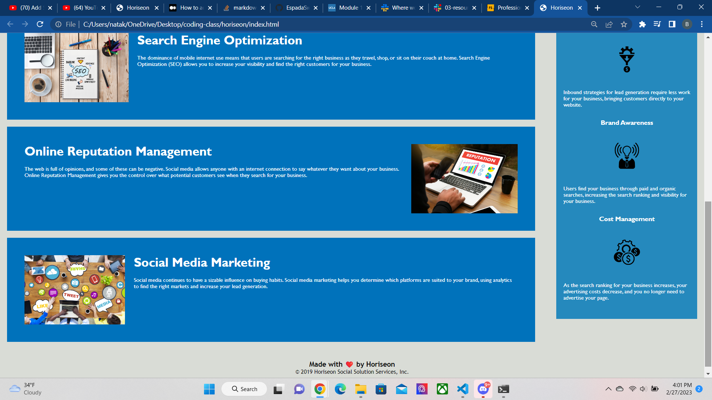

# Horiseon

## Description
    Primary objectives: To refine code by properly labeling HTML elements, remove excess code so as to make code concise, repair any broken links or improper appearances on the webpage so as to develop a more accessible website. 

    Process:   
    Edits to HTML element titles from "div-(etc)" to proper syntax (headers, aside, section, article, etc).
    Refine code to make it more concise by recategorizing elements together that shared similar formating and removing excess/duplicate code(done in HTML and CSS). 
    Assign descriptions to images to allow for greater accessability.
    Repaired broken link in navigation bar by properly classifying "id".

## Installation

    Download repository from github links.
    https://github.com/EspadaSworn/horiseon 
    
    Main website
    https://espadasworn.github.io/horiseon/
    
## Usage

    To be used to create a website with organized flow and navigation so as to improve accessability.

## Credits

Diarmuid Murphy,
Meg Meyers,
John Word https://youtu.be/Z_S-KWs7yHk 

